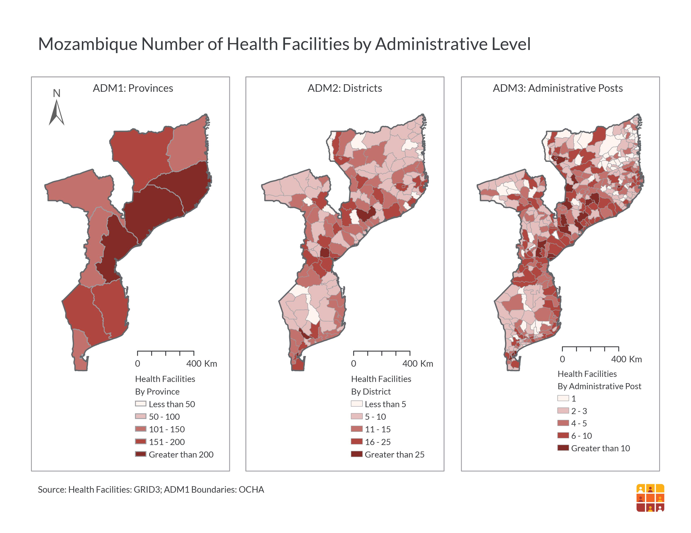
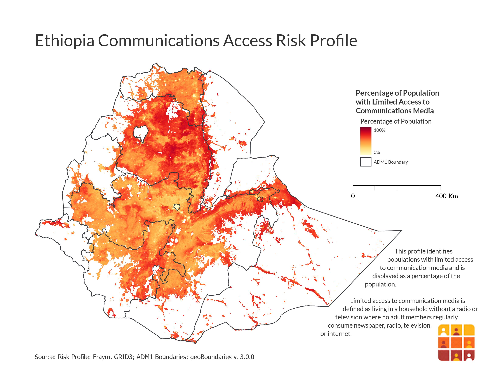
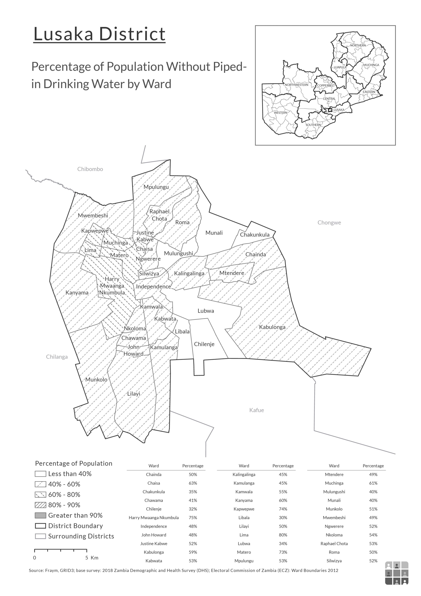
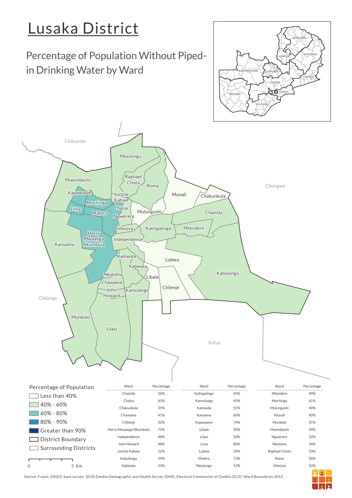

# Lydia Troup Portfolio

## Coding Product Examples

### Modeling Demographic Data in Liberia
[Modeling Demographic Data in Liberia](https://lydiatroup.github.io/146_EC/)

**Above** is a webpage created using github, which explains and compares various models to predict the education of populations in Liberia. The products on this site were produced using python and the sklearn toolkit.

### Human Development in Yucatan, Mexico
[Human Development in Yucatan Mexico](https://lydiatroup.github.io/workshop/final_project)

**Above** is a webite created using github, which details an analysis of human development and demographics in the Yucatan region of Mexico. The products on this site were producted using R.

## GIS Product Examples

### Instant App Gallery
[Instant App Gallery displaying shareable work from 2021 summer internship with ESRI](https://webapps.maps.arcgis.com/apps/instant/filtergallery/index.html?appid=9e55124ebb2149ebac9e94a2cf01fbe1)

**Above** is a Category Gallery Instant App with the shareable apps and documents produced in my 2021 Summer internship with ESRI. Outside of these deliverables, user personas, starts to a style guide, and issues to address bugs were produced. Additionally, holistic testing events and intern professional development trainings were attended.

### Storymap on Suitability for a Free Clinic in Washington DC
[Storymap on Suitability for Free Clinic in Washington DC](https://storymaps.arcgis.com/stories/8984a2f9a41747f3bee55ebc69f5b819)

**Above** is a story map completed in May 2020, analyzing an ideal location for a new free clinic in Washington DC. This was completed predominantly using ArcGis Online.

### Storymap Analyzing Fitest Cities
[Storymap on Fit Cities](https://arcg.is/1Kb0zy0)

**Above** is a story map completed in January 2021, displaying the ACSM's most fit cities in the United States and analyzing the the differences between a city high and one low on the spectrum.

### Storymap on Coronavirus' Early Spread in the USA
[Storymap on Coronavirus in USA](https://storymaps.arcgis.com/stories/b73259fdc8ea4381adf097470e400adc)

*A note: This was last updated in mid April of 2020* 

**Above** is a story map completed in April of 2020, detailing the early spread of Coronavirus and states' responses in the United States. The data for this storymap was manipulated using ArcPro, then imported into ArcGis Online for the final product

### Layout Detailing Correlation between Shootings and Home Values in NYC

[Associated Storymap](https://arcg.is/1LSLrS0)

**Above** is the associated storymap
The layout above was created in June of 2019 using ArcMap. The associated storymap was created in ArcGis Online.

### Visualization of Healthcare Facilities by Region in Mozambique

The above layout was created in Summer of 2020 using ArcPro for CIEIN's GRID3 Project

### Visualization of Communication Risk Index in Ethiopia

The above layout was created in Summer of 2020 using ArcPro for CIESIN's GRID3 Project

### Visualizations of Coronavirus Risk Factors in Zambia
Below are layouts illustrating a Coronavirus risk factor (piped in water) across Zambia. These were created in the summer of 2020 using ArcPro for CIESIN's GRID3 project. Both black and white and color versions were created; black and white for distribution, color for reference.
- Black and White Version:
    
- Color Version:
    
